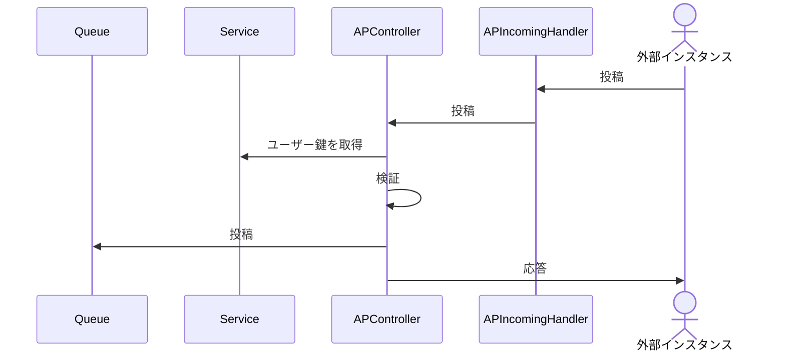

```mermaid
sequenceDiagram
    participant Queue
    participant Service
    participant APController
    participant APIncomingHandler
    actor 外部インスタンス
    
    外部インスタンス ->> APIncomingHandler: 投稿
    APIncomingHandler ->> APController: 投稿
    APController ->> Service: ユーザー鍵を取得
    APController ->> APController: 検証
    APController ->> Queue: 投稿
    APController ->> 外部インスタンス: 応答

    

    
```
