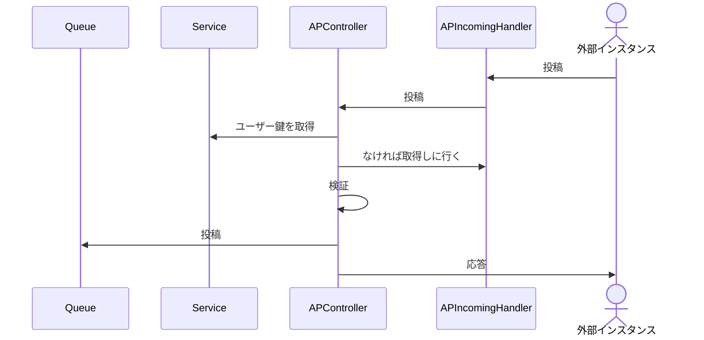
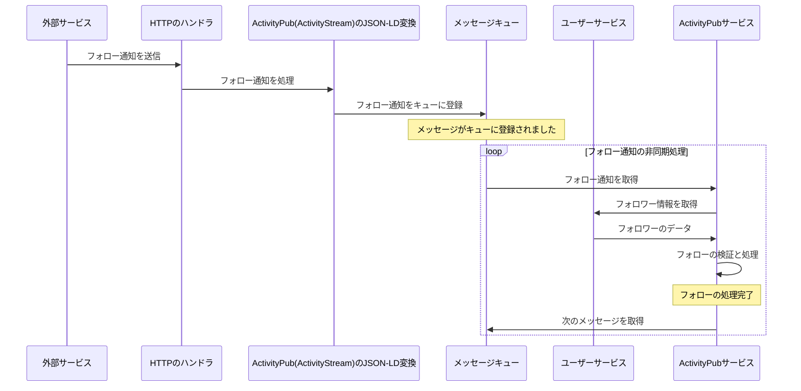

```mermaid
sequenceDiagram
    participant Queue
    participant Service
    participant APController
    participant APIncomingHandler
    actor 外部インスタンス
    
    外部インスタンス ->> APIncomingHandler: 投稿
    APIncomingHandler ->> APController: 投稿
    APController ->> Service: ユーザー鍵を取得
    APController ->> APIncomingHandler: なければ取得しに行く
    APController ->> APController: 検証
    APController ->> Queue: 投稿
    APController ->> 外部インスタンス: 応答

    

    
```

```mermaid
sequenceDiagram
    participant 外部サービス as 外部サービス
    participant ハンドラ as HTTPのハンドラ
    participant コントローラー as ActivityPub(ActivityStream)のJSON-LD変換
    participant メッセージキュー as メッセージキュー
    participant ユーザーサービス as ユーザーサービス
    participant ActivityPubサービス as ActivityPubサービス

    外部サービス->>ハンドラ: フォロー通知を送信
    ハンドラ->>コントローラー: フォロー通知を処理
    コントローラー->>メッセージキュー: フォロー通知をキューに登録
    Note over メッセージキュー: メッセージがキューに登録されました

    loop フォロー通知の非同期処理
        メッセージキュー->>ActivityPubサービス: フォロー通知を取得
        ActivityPubサービス->>ユーザーサービス: フォロワー情報を取得
        ユーザーサービス->>ActivityPubサービス: フォロワーのデータ
        ActivityPubサービス->>ActivityPubサービス: フォローの検証と処理
        Note over ActivityPubサービス: フォローの処理完了
        ActivityPubサービス->>メッセージキュー: 次のメッセージを取得
    end

```
